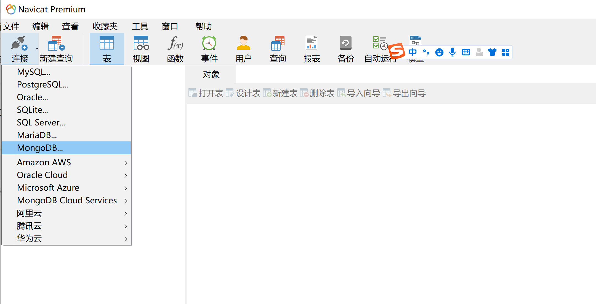
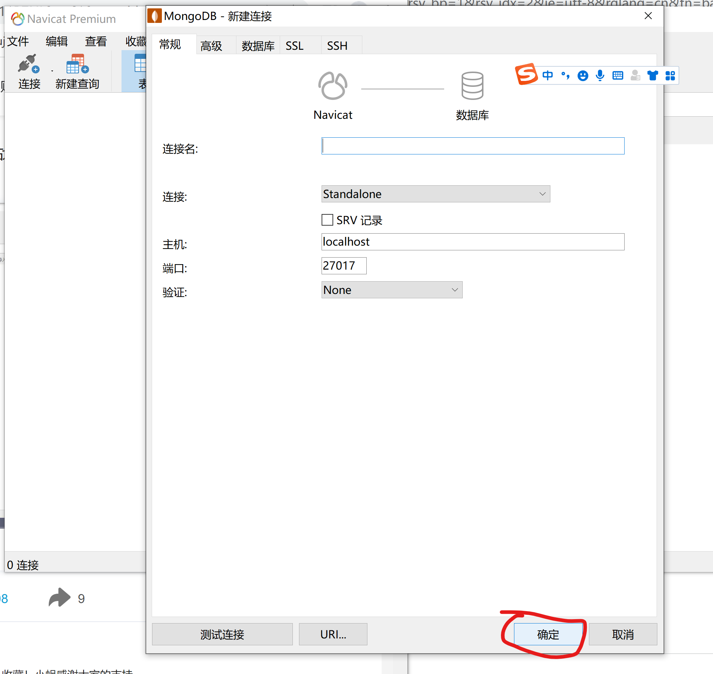
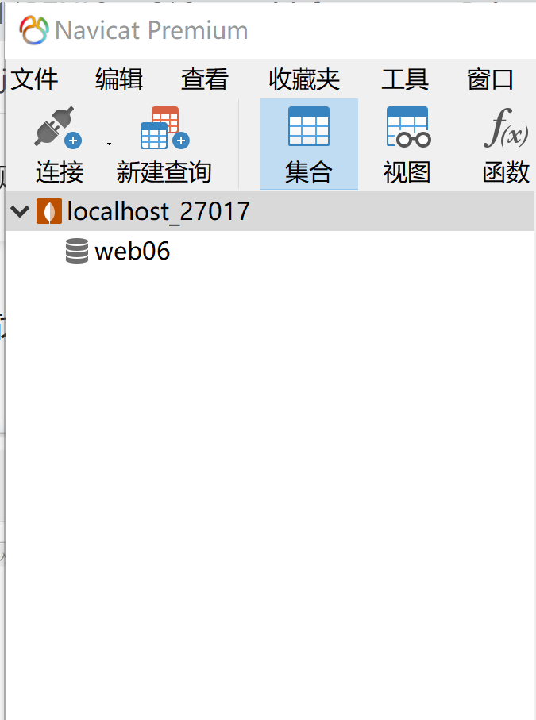
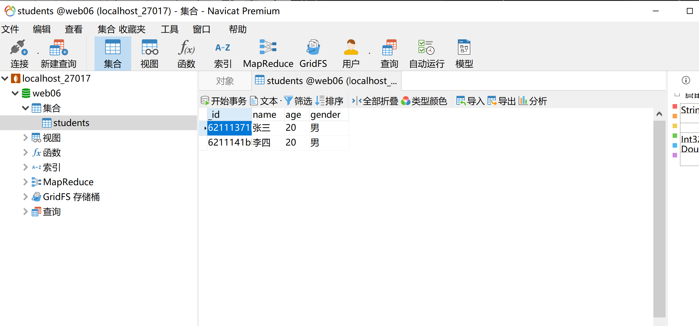

## Node_Express搭建前后台手顺
[Express官网](https://www.expressjs.com.cn/)
**前提：已安装nodejs**
1. **全局安装express-generator(exExpress应用生成器)**
    ```js
    npm i express-generator -g
    ```
2. **创建Express项目**
    ```js
    express express-project
    ```
3. **下载项目依赖包**
    ```js
    npm i
    ```
4. **启动项目**
    ```js
    npm start
    ```
5. **在浏览器中输入以下地址：**
    ```js
    // localhost:3000
    ```
#### **Express目录介绍**
+ bin
    + www -- 创建服务器文件
+ public -- 放前端代码，默认加载index.html
+ routes -- 服务器代码：接收前端ajax请求，并将请求做处理(向数据库插入/获取数据，返回状态)
+ views -- 后端写页面的文件(除非对首页渲染速度有特别高的要求，否则不用)
    + .jade -- jade是模版引擎，后端渲染好数据页面，速度快
+ app.js -- 服务器入口文件


6. **保存文件自动重启服务插件**
    ```js
    npm i nodemon -g

    // 安装之后启动服务可以用命令
    nodemon app.js
    ```
    nodemon 命令报错
    [解决方案参考](https://blog.csdn.net/webjxy/article/details/121193543)


7. **下载jquery，使用jquery的ajax处理前端请求**
    ```js
    npm i jquery --save

    // 将下载到node_modules文件夹中的jquery.min.js复制到public/js文件夹中，方便前端代码引用
    ```

8. **安装MongoDB**
   > [安装MongoDB链接](https://www.runoob.com/mongodb/mongodb-window-install.html)
    #### **命令行操作**
    1. 找到MongoDB安装包中的bin/mongo.exe,双击打开;
    2. 查看当前MongoDB服务器中所有的数据库：在MongoDB终端输入 
        ```js
        show dbs
        ```
    3. 查看当前指向的数据库：在MongoDB终端输入 
        ```js
        db
        ```
    4. 新建/切换数据库：在MongoDB终端输入 
        ```js
        use 数据库名称
        ```
    5. 查看当前数据库中所有的集合：
        ```js
        show collections
        ```
    6. 往集合中添加数据（如果该集合不存在，则会自动创建该集合）
        ```js
        db.集合名称.insert({name: "张三", age: "20", gender: "男"})
        ```
    7. 查看某个集合中所有的数据
        ```js
        db.集合名称.find()
        db.集合名称.find().pretty()   // 格式化之后的
        ```
    
9. **安装navicat(数据库可视化工具)**
    1. 
    2. 
    3. 
    4. 

10. **通过后端代码操作数据库**
    1. **连接数据库**
    ```js
    // 下载mongoose: mongoose是Nodejs中提供的一个用于便捷操作MongoDB的库。
    npm i mongoose --save
    ```
    ```js
    // 将express项目与mongodb服务器连接起来
    const mongoose = require('mongoose');
    const dbURI = 'mongodb://localhost:27017/web06';  // 项目需要连接的mongodb数据库地址
    mongoose.connect(dbURI);
    // 当项目与数据库连接成功时，触发下列事件
    mongoose.connection.on('connected', function() {
        console.log(dbURI + '数据库连接成功');
    })
    ```
    2. **配置集合**
    当数据库连接成功之后，就可以开始去操作数据库中的集合了。
    但是，在首次操作之前，需要先对要操作的集合进行相关的配置。
    + **配置集合结构**：定义出集合中数据有哪些属性，每一个属性的值是什么数据类型。
    ```js
    const { Schema } = require('mongoose');

    const usersSchema = new Schema({
        username: String,
        password: String
    });
    ```

    + **配置集合模型**
        - 将上一步中的schema集合结构和数据库中的集合关联起来，得到一个数据模型。
        - 所有关于数据集合中数据的操作方法，都是数据模型提供的。
        ```js
        const { model } = require('mongoose');
        const usersModel = model('usersModel', usersSchema, 'users')
        ``` 
    3. **操作数据**
    + 查询、查找
        - 按条件查询
        ```js
        usersModel.find({ username: '张三' });
        ```
        - 查询所有数据
        ```js
        usersModel.find()
        ```
    + 新增
    ```js
    usersModel.create({username: '123', password: '123'});
    ```
    + 删除
    ```js
    usersModel.deleteOne({ _id: '1' }); // 删除一条_id: '1' 的数据
    usersModel.deleteMany({ username: 'zhangsan' }); // 删除所有 username: 'zhangsan' 的数据
    ```
    + 修改
    ```js
    usersModel.updateOne({_id: 1}, { username: 'lisi', password: '123' }); // 第一个参数，查找更新的数据；第二个参数，更新的新数据。
    ```
11. **后端代码三层架构拆分**
> 
 1. 表现层：处理前端请求
 2. 服务层：处理业务逻辑(业务逻辑相关代码)
 3. 持久层：操作数据库(放和操作数据库相关的东西)

> 代码文件拆分
 1. 表现层：routes
 2. 服务层：service
 3. 持久层：dao

 12. **node作为代理服务器**
 > 见 proxy-service 项目
 